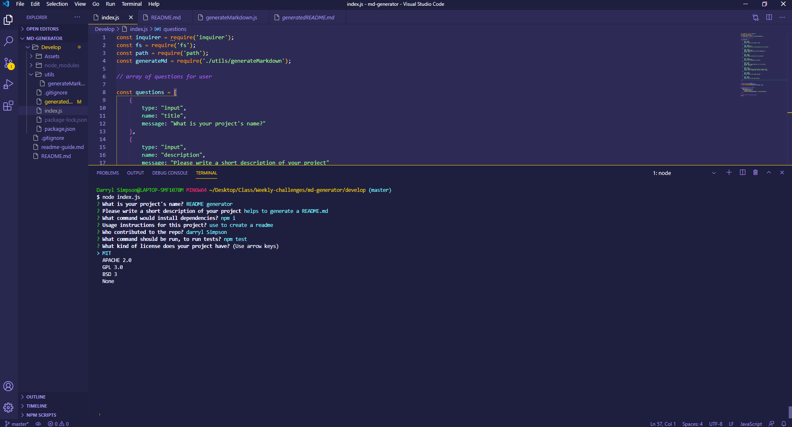
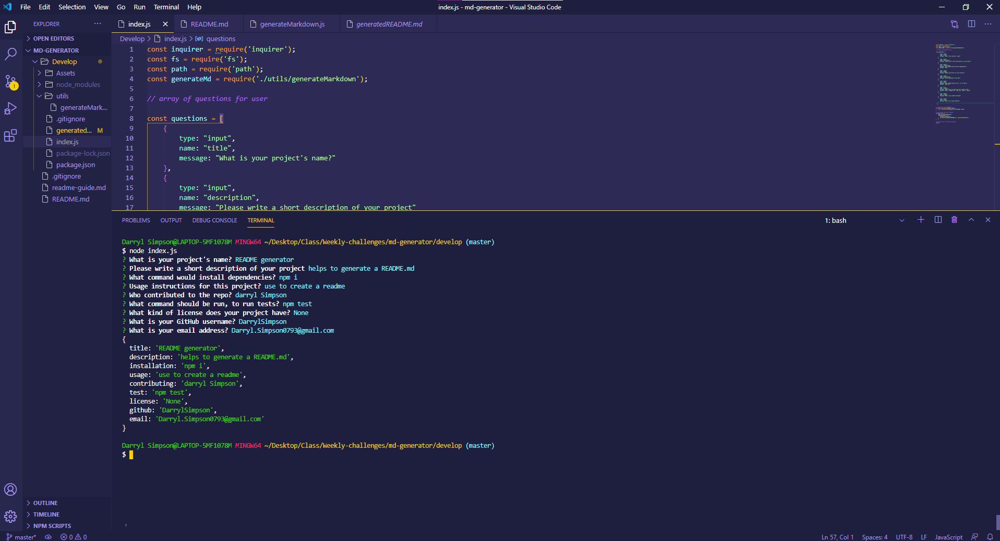
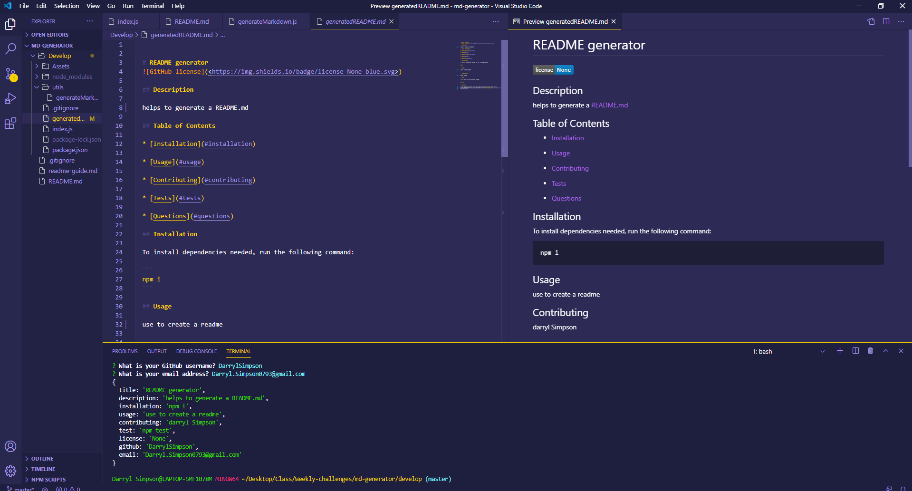

# README Generator!

* AS A developer
* I WANT a README generator,
* SO THAT can quickly create a professional README for a new project.

# Table of Contents

 Table of contents

 * [About the Project](#About-The-Project)
    * [Built With](#built-with)

* [Usage](#usage)
    * [Pictures](#pictures)

* [Link to Page](#link-to-page)

* [Contact](#contact)
    * [Creators](#creator)

# About The Project
* GIVEN a command-line application that accepts user input
* WHEN you are prompted for information about my application repository
* THEN a high-quality, professional README file is generated with the title of your project and sections entitled Description, Table of Contents, Installation, Usage, License, Contributing, Tests, and Questions
* WHEN you enter your project title
* THEN that is displayed as the title of the README
* WHEN you enter a description, installation instructions, usage information, contribution guidelines, and test instructions
* THEN that information is added to the sections of the README entitled Description, Installation, Usage, Contributing, and Tests
* WHEN you choose a license for my application from a list of options
* THEN a badge for that license will be added near the top of the README and a notice is added to the section of the README entitled License that explains which license the application is covered under
* WHEN you enter your GitHub username
* THEN it is added to the section of the README entitled Questions, with a link to my GitHub profile
* WHEN you enter your email address
* THEN it will be added to the section of the README entitled Questions, with instructions on how someone would reach you with additional questions
* WHEN you click on the links in the Table of Contents
* THEN you will be taken to the corresponding section of the README

## Built With
 * HTML
 * [Node](https://nodejs.org/en/)

# Usage

## Video Instructions

## Pictures

# Link to Page

* [Follow this Link to page](https://darrylsimpson.github.io/README-Generator/)

# Contact

## Creator

* [Check out my GitHub](https://github.com/DarrylSimpson) , or email me at [Darryl.Simpson0793@gmail.com](mailto:Darryl.Simpson0793@gmail.com)

